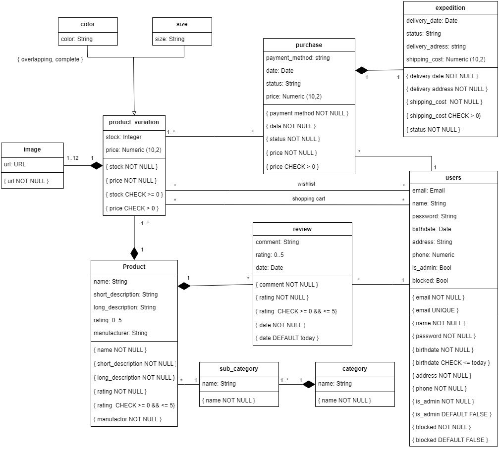

# EBD: Database Specification Component

SportsVerse! The only place you need for a healthy and active lifestyle

## A4: Conceptual Data Model

The Conceptual Data Model contains the identification and description of the entities and relationships that are relevant to the database specification, so a UML class diagram is required to document the model.

### 1. Class diagram

The UML diagram in Figure 1 presents the main organizational entities, the relationships between them, attributes and their domains, and the multiplicity of relationships for the SportVerse platform.

 <br>
Figure 1: SportVerse conceptual data model in UML.

### 2. Additional Business Rules
 
- BR01.  Product rating is calculated using the average of the reviews rating of that product.
- BR02.  When a product is bought, its stock is subtracted from the amount bought.
- BR03.  A product variation can have a maximum of 12 images..


---


## A5: Relational Schema, validation and schema refinement

This artifact contains the Relational Schema obtained by mapping from the Conceptual Data Model. The Relational Schema includes each relation schema, attributes, domains, primary keys, foreign keys and other integrity rules.

### 1. Relational Schema

| Relation reference | Relation Compact Notation                        |
| ------------------ | ------------------------------------------------ |
| R01                | users(<ins>id</ins> , email __UK__ __NN__, name __NN__, password __NN__, birthdate __NN__ __CK__ birthdate < = today, address __NN__, phone __NN__, is_admin __NN__ __DF__ FALSE, blocked __NN__ __DF__ FALSE)                   |
| R02                | category(<ins>id</ins> , name __NN__) |
| R03                | sub_category(<ins>id</ins> , name __NN__, id_category->category __NN__)          |
| R04                | color(<ins>id</ins> , color __NN__) |
| R05                | size(<ins>id</ins> , size __NN__) |
| R06                | product(<ins>id</ins> , name __NN__, short_description __NN__, long_description __NN__, rating __NN__ __CK__ rating >= 0 AND rating <= 5, manufacturer __NN__, id_sub_category->sub_category) |
| R07                | product_variation(<ins>id</ins> , id_prod->product, stock __NN__ __CK__  stock >= 0, price __NN__ __CK__  price > 0, id_size->size __NN__, id_color->color __NN__) |
| R08                | product_image(<ins>id</ins> , url __NN__, id_prod_var->product_variation __NN__) |
| R09                | wishlist(<ins>id_prod_var</ins>->product_variation, <ins>id_user</ins>->users) |
| R10                | shopping_cart(<ins>id_prod_var</ins>->product_variation, <ins>id_user</ins>->users, quantity __NN__ __CK__  quantity > 0) |
| R11                | review(<ins>id_user</ins>->users, <ins>id_product</ins>->product, comment __NN__, rating __NN__ __CK__  rating >= 0 AND rating < = 5, date __NN__ __DF__ today) |
| R12                | purchase(<ins>id</ins> , payment_method __NN__, date __NN__ __DF__ today, id_user->users __NN__, price  __NN__ __CK__  price > 0, status __NN__ __CK__  status IN purchase_status) |
| R13                | product_purchase(<ins>id_prod_var</ins>->product_variation, <ins>id_purchase</ins>->purchase, quantity __NN__ __CK__  quantity > 0) |
| R14                | expedition(<ins>id_purchase</ins>->purchase, delivery_date __NN__, status __NN__ __CK__  status IN expedition_status, delivery_address __NN__, shipping_cost __NN__ __CK__  shipping_cost > 0) |

Table 1: SportVerse relational schema


Legend:
- __UK__ = UNIQUE KEY
- __NN__ = NOT NULL
- __DF__ = DEFAULT
- __CK__  = CHECK.

---
### 2. Domains

| Domain Name           | Domain Specification           |
| -----------           | ------------------------------ |
| today	                | DATE DEFAULT CURRENT_DATE      |
| purchase_status       | ENUM (‘Payment Pending’, ‘Processing’, ‘Shipping’, ‘Canceled’, ‘Concluded’)|
| expedition_status     | ENUM (‘Created’, ‘In Transit’, ‘Delivered’)|

Table 2: SportVerse Domains

---

### 3. Schema validation

| **TABLE R01**   | users               |
| --------------  | ---                |
| **Keys**        | {id},{email} |
| **Functional Dependencies:** |       |
| FD0101          | {id} -> {email, name, password, birthdate, address, phone, is_admin, blocked}|
| FD0102          | {email} -> {id, name, password, birthdate, address, phone, is_admin, blocked}|
| **NORMAL FORM** | BCNF               |

| **TABLE R02**   |    category                |
| --------------  | ---                |
| **Keys**        |      {id}             |
| **Functional Dependencies:** |       |
| FD0201          |  {id} -> {name}   |
| **NORMAL FORM** | BCNF               |

| **TABLE R03**   |      sub_category              |
| --------------  | ---                |
| **Keys**        |        {id}            |
| **Functional Dependencies:** |       |
| FD0301          |  {id} -> {name, id_category}   |
| **NORMAL FORM** | BCNF               |

| **TABLE R04**   |       color             |
| --------------  | ---                |
| **Keys**        |       {id}             |
| **Functional Dependencies:** |       |
| FD0401          |  {id} -> {color}   |
| **NORMAL FORM** | BCNF               |

| **TABLE R05**   |         size           |
| --------------  | ---                |
| **Keys**        |          {id}          |
| **Functional Dependencies:** |       |
| FD0501          |  {id} -> {size}   |
| **NORMAL FORM** | BCNF               |

| **TABLE R06**   |      product              |
| --------------  | ---                |
| **Keys**        |      {id}              |
| **Functional Dependencies:** |       |
| FD0601          |  {id} -> {name, short_description, longe_description, rating, manufacturer, id_sub_category}   |
| **NORMAL FORM** | BCNF               |

| **TABLE R07**   |      product_variation              |
| --------------  | ---                |
| **Keys**        |      {id}              |
| **Functional Dependencies:** |       |
| FD0701          |   {id} -> {id_prod, stock, price, id_size, id_color}  |
| **NORMAL FORM** | BCNF               |

| **TABLE R08**   |       product_image             |
| --------------  | ---                |
| **Keys**        |        {id}            |
| **Functional Dependencies:** |       |
| FD0801          |  {id} -> {url, id_prod_var}   |
| **NORMAL FORM** | BCNF               |

| **TABLE R09**   |       wishlist             |
| --------------  | ---                |
| **Keys**        |       {id_prod_var, id_user}             |
| **Functional Dependencies:** |       |
| None         |   |
| **NORMAL FORM** | BCNF               |

| **TABLE R10**   |      shopping_cart              |
| --------------  | ---                |
| **Keys**        |     {id_prod_var, id_user}               |
| **Functional Dependencies:** |       |
| FD1001          |  {id_prod_var, id_user} -> {quantity}   |
| **NORMAL FORM** | BCNF               |

| **TABLE R11**   |       review             |
| --------------  | ---                |
| **Keys**        |       {id_prod, id_user}             |
| **Functional Dependencies:** |       |
| FD1101          |   {id_prod, id_user} -> {comment, rating, date}  |
| **NORMAL FORM** | BCNF               |

| **TABLE R12**   |       purchase             |
| --------------  | ---                |
| **Keys**        |     {id}               |
| **Functional Dependencies:** |       |
| FD1201          |  {id} -> {payment_method, date, id_user, price}   |
| **NORMAL FORM** | BCNF               |

| **TABLE R13**   |                    |
| --------------  | ---                |
| **Keys**        |     {id_prod_var, id_user}              |
| **Functional Dependencies:** |       |
| FD1301          |  {id_prod_var, id_user} -> {quantity}   |
| **NORMAL FORM** | BCNF               |

| **TABLE R14**   |     expedition               |
| --------------  | ---                |
| **Keys**        |      {id_purchase}              |
| **Functional Dependencies:** |       |
| FD1401          |   {id_purchase} -> {delivery_date, status, delivery_address, shipping_cost}  |
| **NORMAL FORM** | BCNF               |

Table 3: SportVerse schema validation

Because all relations are in the Boyce–Codd Normal Form (BCNF), the relational schema is also in the BCNF and, therefore, the schema does not need to be further normalized.


---


## A6: Indexes, triggers, transactions and database population

This artifact contains the physical schema of the database, the identification and characterization of the indexes, the support of data integrity rules with triggers and the definition of the database user-defined functions. Also contains the database transactions needed to assure the integrity of the data, workload as well as the complete database creation script.

### 1. Database Workload

| **Relation reference** | **Relation Name** | **Order of magnitude**        | **Estimated growth** |
| ------------------ | ------------- | ------------------------- | -------- |
| R01 | user | 10 k (tens of thousands) | 10 (tens) / day |
| R02 | category | 1 (units) | 1 / year |
| R03 | sub_category | 10 (tens) | 1 / year |
| R04 | color | 10 | no growth |
| R05 | size | 10 | no growth  |
| R06 | product | 1 k (thousands) | 10 / month |
| R07 | product_variation | 10 k | 10 / week |
| R08 | product_image | 100 k (hundreds of thousands) | 100 (hundreds) / month |
| R09 | wishlist | 10 k | 10 / day |
| R10 | shopping_cart | 10 k | 100 / day |
| R11 | review | 10 k | 10 / day |
| R12 | purchase | 100 k | 100 / day |
| R13 | product_purchase | 100 k | 1 k / day |
| R14 | expedition | 10 k | 10 / day |

Table 4: SportVerse Database Workload


### 2. Proposed Indices

#### 2.1. Performance Indices
 
> Indices proposed to improve performance of the identified queries.

| **Index**           | IDX01                                  |
| ---                 | ---                                    |
| **Relation**        | purchase   |
| **Attribute**       | id_user  |
| **Type**            | Hash          |
| **Cardinality**     | medium |
| **Clustering**      | No               |
| **Justification**   | Table `purchase` is frequently accessed to obtain a user’s purchase history. Since filtering is done by exact match, a hash type is best suited. The expected update frequency is medium, thus no clustering is proposed.   |
| **SQL Code** | `CREATE INDEX` user_purchases `ON` Purchase `USING` `hash` (id_user); |

Table 5: Performance Index 1


| **Index**           | IDX02                                 |
| ---                 | ---                                    |
| **Relation**        | review   |
| **Attribute**       | id_product  |
| **Type**            | Hash          |
| **Cardinality**     | medium |
| **Clustering**      | No               |
| **Justification**   | Table `review` is frequently accessed to obtain a product’s reviews. Since filtering is done by exact match, a hash type is best suited. `id_product` candidates for clustering on table `review`, since obtaining all reviews for a given product is a frequent request. However, the expected update frequency is medium, so no clustering is proposed.  |
| **SQL Code** | `CREATE INDEX` product_reviews `ON` Review `USING hash` (id_product); |

Table 6: Performance Index 2


| **Index**           | IDX03                                  |
| ---                 | ---                                    |
| **Relation**        | product_variation   |
| **Attribute**       | id_user  |
| **Type**            | B-Tree          |
| **Cardinality**     | medium |
| **Clustering**      | Yes               |
| **Justification**   | Table `product_variation` is very large. Several queries need to frequently access the variations of the products. Since filtering is done by an exact match, a hash type index would be best suited. However, since we want to apply clustering based on this index, and clustering is not possible on hash type indexes, we opted for a b-tree index. Update frequency is low and cardinality is medium so it’s a good candidate for clustering.   |
| **SQL Code** | `CREATE INDEX` product_variations `ON` product_variation `USING btree` (id_prod);<br>`CLUSTER` product_variation `USING` product_variations; |

Table 7: Performance Index 3


#### 2.2. Full-text Search Indices 

> The system being developed must provide full-text search features supported by PostgreSQL. Thus, it is necessary to specify the fields where full-text search will be available and the associated setup, namely all necessary configurations, indexes definitions and other relevant details.  

| **Index**           | IDX11                                  |
| ---                 | ---                                    |
| **Relation**        | product   |
| **Attribute**       | name, short_description   |
| **Type**            | GIN              |
| **Clustering**      | No               |
| **Justification**   | To provide full-text search features to look for products based on matching names or descriptions (short descriptions). The index type is GIN because the indexed fields are not expected to change.   |
| `SQL code`                                                  | 
```sql

 -- Add column to work to store computed ts_vectors.
 ALTER TABLE sportsverse.product
 ADD COLUMN tsvectors TSVECTOR;
 
 
 -- Create a function to automatically update ts_vectors
CREATE OR REPLACE FUNCTION search_product_update_tf()
 RETURNS trigger
 LANGUAGE 'plpgsql'
 COST 100
 VOLATILE NOT LEAKPROOF
 AS $BODY$
 BEGIN
    IF (TG_OP = 'INSERT') THEN
        NEW.tsvectors = (
        setweight(to_tsvector('english', NEW.name), 'A') ||
        setweight(to_tsvector('english', NEW.short_description), 'B')
        );
    END IF;
    IF (TG_OP = 'UPDATE') THEN
        IF (NEW.name <> OLD.name OR NEW.short_description <> OLD.short_description)
        THEN NEW.tsvectors = (
            setweight(to_tsvector('english', NEW.name), 'A') ||
            setweight(to_tsvector('english', NEW.short_description), 'B')
        );
        END IF;
    END IF;
 RETURN NEW;
 END
 $BODY$;
 
 
 -- Create Trigger before insert or update on product
 CREATE TRIGGER search_product_update_t
    BEFORE INSERT OR UPDATE
    ON sportsverse.product
    FOR EACH ROW
    EXECUTE FUNCTION search_product_update_tf();

```
Table 8: Full-text Search Index


### 3. Triggers

| **Trigger**      | TRIGGER01                              |
| ---              | ---                                    |
| **Description**  | Product rating is calculated using the average of the reviews rating of that product. |
| `SQL code`

```sql

CREATE OR REPLACE FUNCTION update_product_rating()
    RETURNS trigger
    LANGUAGE 'plpgsql'
    COST 100
    VOLATILE NOT LEAKPROOF
    AS $BODY$
    BEGIN
        UPDATE sportsverse.product
        SET rating = (SELECT AVG(rating) FROM sportsverse.review)
        WHERE NEW.id_product = product.id;
        RETURN NEW;
    END


$BODY$;


CREATE TRIGGER update_rating
    AFTER INSERT OR UPDATE
    ON sportsverse.review
    FOR EACH ROW
    EXECUTE FUNCTION update_product_rating();

```
Table 9: Product rating Trigger


| **Trigger**      | TRIGGER02                             |
| ---              | ---                                    |
| **Description**  | When a product is bought, its stock is subtracted from the amount bought. |
| `SQL code`                                             |

```sql

CREATE OR REPLACE FUNCTION update_product_stock()
    RETURNS trigger
    LANGUAGE 'plpgsql'
    COST 100
    VOLATILE NOT LEAKPROOF
    AS $BODY$
    BEGIN
        UPDATE sportsverse.product_variation SET stock=stock-NEW.quantity WHERE sportsverse.product_variation.id=NEW.id_prod_var;
        RETURN NEW;
    END
$BODY$;


CREATE TRIGGER update_stock
    BEFORE INSERT
    ON sportsverse.product_purchase
    FOR EACH ROW
    EXECUTE FUNCTION update_product_stock();

```
Table 10: Product bought Trigger

| **Trigger**      | TRIGGER03                              |
| ---              | ---                                    |
| **Description**  | When the user deletes its account, his contributions for the site remains visible as anonymous. |
| `SQL code`                                             |
```sql

CREATE OR REPLACE FUNCTION delete_user_tf()
    RETURNS trigger
    LANGUAGE 'plpgsql'
    COST 100
    VOLATILE NOT LEAKPROOF
AS $BODY$
BEGIN
    UPDATE sportsverse.users SET name = 'Anonymous', birthdate = '1901-01-01', address = 'Anonymous', phone_number = 0 WHERE id = OLD.id;
    IF NOT FOUND THEN RETURN NULL; 
    END IF;
    RETURN NULL;
END
$BODY$;


CREATE TRIGGER delete_user_t
    BEFORE DELETE
    ON sportsverse.users
    FOR EACH ROW
    EXECUTE FUNCTION delete_user_tf();

```

Table 11: Delete user Trigger

| **Trigger**      | TRIGGER04                              |
| ---              | ---                                    |
| **Description**  | A product can have a maximum of 12 images. |
| `SQL code`                                             |
```sql
CREATE OR REPLACE FUNCTION limit_product_images()
    RETURNS trigger
    LANGUAGE 'plpgsql'
    COST 100
    VOLATILE NOT LEAKPROOF
    AS $BODY$
    BEGIN
        IF ((SELECT COUNT(NEW.id) FROM sportsverse.product_image WHERE sportsverse.product_image.id_prod_var = NEW.id_prod_var) > 11) THEN
            RAISE EXCEPTION 'Cannot insert more than 12 images';
        ELSE
            RETURN NEW;
        END IF;
    END

$BODY$;


CREATE TRIGGER limit_product_images
    BEFORE INSERT
    ON sportsverse.product_image
    FOR EACH ROW
    EXECUTE FUNCTION limit_product_images();

```
Table 12: Limit images Trigger

| **Trigger**      | TRIGGER05                              |
| ---              | ---                                    |
| **Description**  | A blocked user can't make a purchase. |
| `SQL code`                                             |
```sql
CREATE OR REPLACE FUNCTION blocked_user_tf()
    RETURNS trigger
    LANGUAGE 'plpgsql'
    COST 100
    VOLATILE NOT LEAKPROOF
    AS $BODY$
    BEGIN
        IF EXISTS (SELECT * FROM sportsverse.users WHERE id = NEW.id AND blocked = TRUE) THEN
            RAISE EXCEPTION 'Blocked users are not able to make a purchase';
        ELSE
            RETURN NEW;
        END IF;
    END

$BODY$;


CREATE TRIGGER blocked_user_t
    BEFORE INSERT
    ON sportsverse.purchase
    FOR EACH ROW
    EXECUTE FUNCTION blocked_user_tf();
```
Table 13: Blocked Users can't purchase Trigger

| **Trigger**      | TRIGGER06                              |
| ---              | ---                                    |
| **Description**  | A blocked user can't make a review. |
| `SQL code`                                             |
```sql
CREATE OR REPLACE FUNCTION blocked_user_review_tf()
    RETURNS trigger
    LANGUAGE 'plpgsql'
    COST 100
    VOLATILE NOT LEAKPROOF
    AS $BODY$
    BEGIN
        IF EXISTS (SELECT * FROM sportsverse.users WHERE id = NEW.id AND blocked = TRUE) THEN
            RAISE EXCEPTION 'Blocked users are not able to make a review';
        ELSE
            RETURN NEW;
        END IF;
    END

$BODY$;


CREATE TRIGGER blocked_user_review_t
    BEFORE INSERT
    ON sportsverse.review
    FOR EACH ROW
    EXECUTE FUNCTION blocked_user_review_tf();
```
Table 13: Blocked Users can't review Trigger

### 4. Transactions
 
> Transactions needed to assure the integrity of the data.  

| Transaction  | Tran01                   |
| --------------- | ----------------------------------- |
| Description     | Create a new product_variation |
| Justification   | Created this event chain in order to ensure all code is executed without the influence of external factors. ROLLBACK command can be executed whenever an inserting error occurs. The isolation level chosen was REPEATABLE READ, in order to guarantee that no change in ‘Product_id_seq’ occurs while this transaction takes place.  |
| Isolation level | REPEATABLE READ |
| `SQL Code`                                   ||
```sql
BEGIN TRANSACTION;

SET TRANSACTION ISOLATION LEVEL REPEATABLE READ

-- Insert product
INSERT INTO product (name, short_description, long_description, rating, manufacturer, id_sub_category)
VALUES ($name, $short_description, $long_description, $rating, $manufacturer, $id_sub_category);

-- Insert product_variation
INSERT INTO product_variation (id_prod, stock, price, id_size, id_color)
VALUES (currval('Product_id_seq'), $stock, $price, $id_size, $id_color);

END TRANSACTION;
```
Table 12: New product variation transaction

| Transaction  | Tran02                   |
| --------------- | ----------------------------------- |
| Description     | Create a new product_purchase |
| Justification   | Created this event chain in order to ensure all code is executed without the influence of external factors. ROLLBACK command can be executed whenever an inserting error occurs. The isolation level chosen was REPEATABLE READ, in order to guarantee that no change in ‘Purchase_id_seq’ occurs while this transaction takes place.  |
| Isolation level | REPEATABLE READ |
| `SQL Code`                                   ||
```sql
BEGIN TRANSACTION;

SET TRANSACTION ISOLATION LEVEL REPEATABLE READ

-- Insert purchase
INSERT INTO purchase (payment_method, date, id_user, price, pur_status)
VALUES ($payment_method, $date, $id_user, $price, $pur_status);

-- Insert product_purchase
INSERT INTO product_purchase (id_prod_var, id_purchase, quantity)
VALUES ($id_prod, currval('Purchase_id_seq'), $quantity);

END TRANSACTION;
```
Table 13: New product purchase transaction

| Transaction  | Tran03                   |
| --------------- | ----------------------------------- |
| Description     | Get sub_category number of products, as well as their names |
| Justification   | In the middle of the transaction, the insertion of new rows in the product table (linked to the sub-category in question) can occur, which implies that the information retrieved in both selects is different, consequently resulting in a Phantom Read. It's READ ONLY because it only uses Selects.  |
| Isolation level | SERIALIZABLE READ ONLY |
| `SQL Code` |

```sql
BEGIN TRANSACTION;

SET TRANSACTION ISOLATION LEVEL SERIALIZABLE READ ONLY

-- Get number of products of a sub category
SELECT COUNT (*)
FROM product
WHERE product.id_sub_category = $id;

-- Get the name of the products of that sub-category
SELECT product.name
FROM product, sub_category
WHERE product.id_sub_category = sub_category.id AND sub_category.id = $id;

END TRANSACTION;

```

Table 14: Sub category number of products transaction


## Annex A. SQL Code

> The database scripts are included in this annex to the EBD component.
> 
> The database creation script and the population script should be presented as separate elements.
> The creation script includes the code necessary to build (and rebuild) the database.
> The population script includes an amount of tuples suitable for testing and with plausible values for the fields of the database.
>
> The complete code of each script must be included in the group's git repository and links added here.

### A.1. Database schema

- Link to the creation script: [Creation Script](https://git.fe.up.pt/lbaw/lbaw2223/lbaw2223/-/blob/main/EBD/docs/creation%20script/create_script.sql)


```sql
-------------------------------------
-- DROP OLD SCHEMA
-------------------------------------

SET statement_timeout = 0;
SET lock_timeout = 0;
SET idle_in_transaction_session_timeout = 0;
SET client_encoding = 'UTF8';
SET standard_conforming_strings = on;
SELECT pg_catalog.set_config('search_path', 'public', false);
SET check_function_bodies = false;
SET xmloption = content;
SET client_min_messages = warning;
SET row_security = off;

DROP SCHEMA IF EXISTS sportsverse CASCADE;

CREATE SCHEMA sportsverse;

DROP TABLE IF EXISTS sportsverse.users CASCADE;
DROP TABLE IF EXISTS sportsverse.category CASCADE;
DROP TABLE IF EXISTS sportsverse.sub_category CASCADE;
DROP TABLE IF EXISTS sportsverse.color CASCADE;
DROP TABLE IF EXISTS sportsverse.size CASCADE;
DROP TABLE IF EXISTS sportsverse.product CASCADE;
DROP TABLE IF EXISTS sportsverse.product_variation CASCADE;
DROP TABLE IF EXISTS sportsverse.product_image CASCADE;
DROP TABLE IF EXISTS sportsverse.review CASCADE;
DROP TABLE IF EXISTS sportsverse.shopping_cart CASCADE;
DROP TABLE IF EXISTS sportsverse.wishlist CASCADE;
DROP TABLE IF EXISTS sportsverse.purchase CASCADE;
DROP TABLE IF EXISTS sportsverse.product_purchase CASCADE;
DROP TABLE IF EXISTS sportsverse.expedition CASCADE;


DROP TYPE IF EXISTS sportsverse.expedition_status CASCADE;
DROP TYPE IF EXISTS sportsverse.purchase_status CASCADE;


-------------------------------------
-- TYPES
-------------------------------------


CREATE TYPE sportsverse.expedition_status AS ENUM (
    'Created',
    'In Transit',
    'Delivered'
);


CREATE TYPE sportsverse.purchase_status AS ENUM (
    'Payment Pending',
    'Processing',
    'Shipping',
    'Canceled',
    'Concluded'
);


-------------------------------------
-- TABLES
-------------------------------------


CREATE TABLE sportsverse.users (
    id SERIAL PRIMARY KEY,
    email text NOT NULL UNIQUE,
    name text NOT NULL,
    password text NOT NULL,
    birthdate date NOT NULL,
    address text NOT NULL,
    phone_number numeric NOT NULL,
    is_admin boolean DEFAULT false NOT NULL,
    blocked boolean NOT NULL DEFAULT false,
    CONSTRAINT birthdate_ck CHECK ((birthdate <= CURRENT_DATE))
);


CREATE TABLE sportsverse.category (
    id SERIAL PRIMARY KEY,
    name text NOT NULL
);


CREATE TABLE sportsverse.sub_category (
    id SERIAL PRIMARY KEY,
    name text NOT NULL,
    id_category integer NOT NULL
);


CREATE TABLE sportsverse.color (
    id SERIAL PRIMARY KEY,
    color text NOT NULL
);


CREATE TABLE sportsverse.size (
    id SERIAL PRIMARY KEY,
    size text NOT NULL
);


CREATE TABLE sportsverse.product (
    id SERIAL PRIMARY KEY,
    name text NOT NULL,
    short_description text NOT NULL,
    long_description text NOT NULL,
    rating integer NOT NULL,
    manufacturer text NOT NULL,
    id_sub_category integer NOT NULL REFERENCES sportsverse.sub_category (id) ON UPDATE CASCADE,
    CONSTRAINT product_rating_ck CHECK ((rating >= 0 AND rating <= 5))
);


CREATE TABLE sportsverse.product_variation (
    id SERIAL PRIMARY KEY,
    id_prod integer NOT NULL REFERENCES sportsverse.product (id) ON UPDATE CASCADE,
    stock integer NOT NULL,
    price numeric(10,2) NOT NULL,
    id_size integer NOT NULL REFERENCES sportsverse.size (id) ON UPDATE CASCADE,
    id_color integer NOT NULL REFERENCES sportsverse.color (id) ON UPDATE CASCADE,
    CONSTRAINT product_variation_price_check CHECK ((price > 0)),
    CONSTRAINT product_variation_stock_check CHECK ((stock >= 0))
);


CREATE TABLE sportsverse.product_image (
    id SERIAL PRIMARY KEY,
    url text NOT NULL,
    id_prod_var integer NOT NULL REFERENCES sportsverse.product_variation (id) ON UPDATE CASCADE
);


CREATE TABLE sportsverse.review (
    id_user integer NOT NULL REFERENCES sportsverse.users (id) ON UPDATE CASCADE,
    id_product integer NOT NULL REFERENCES sportsverse.product (id) ON UPDATE CASCADE,
    comment text NOT NULL,
    rating integer NOT NULL,
    date date NOT NULL,
    CONSTRAINT Review_rating_ck CHECK ((rating >= 0 AND rating <= 5))
);


CREATE TABLE sportsverse.shopping_cart (
    id_prod_var integer NOT NULL REFERENCES sportsverse.product_variation (id) ON UPDATE CASCADE,
    id_user integer NOT NULL REFERENCES sportsverse.users (id) ON UPDATE CASCADE,
    quantity integer NOT NULL,
    CONSTRAINT shopping_cart_quantity_check CHECK ((quantity > 0))
);


CREATE TABLE sportsverse.wishlist (
    id_prod_var integer NOT NULL REFERENCES sportsverse.product_variation (id) ON UPDATE CASCADE,
    id_user integer NOT NULL REFERENCES sportsverse.users (id) ON UPDATE CASCADE
);


CREATE TABLE sportsverse.purchase (
    id SERIAL PRIMARY KEY,
    payment_method text NOT NULL,
    date date NOT NULL,
    id_user integer NOT NULL REFERENCES sportsverse.users (id) ON UPDATE CASCADE,
    price numeric(10,2) NOT NULL,
    pur_status sportsverse.purchase_status NOT NULL,
    CONSTRAINT purchase_price_check CHECK ((price > 0))
);


CREATE TABLE sportsverse.product_purchase (
    id_prod_var integer NOT NULL REFERENCES sportsverse.product_variation (id) ON UPDATE CASCADE,
    id_purchase integer NOT NULL REFERENCES sportsverse.purchase (id) ON UPDATE CASCADE,
    quantity integer NOT NULL,
    CONSTRAINT product_purchase_quantity_check CHECK ((quantity > 0))
);


CREATE TABLE sportsverse.expedition (
    id_purchase integer NOT NULL REFERENCES sportsverse.purchase (id) ON UPDATE CASCADE,
    delivery_date date NOT NULL,
    delivery_address text NOT NULL,
    shipping_cost numeric(10,2) NOT NULL,
    exp_status sportsverse.expedition_status NOT NULL,
    CONSTRAINT expedition_shipping_cost_check CHECK ((shipping_cost > 0))
);


-------------------------------------
-- INDEXES
-------------------------------------
CREATE INDEX user_purchases ON  sportsverse.purchase USING hash (id_user);


CREATE INDEX product_reviews ON  sportsverse.review USING hash (id_product);


CREATE INDEX product_variations ON  sportsverse.product_variation USING btree (id_prod);
ALTER TABLE sportsverse.product_variation CLUSTER ON product_variations;


-------------------------------------
-- FTS INDEXES
-------------------------------------


 -- Add column to work to store computed ts_vectors.
 ALTER TABLE sportsverse.product
 ADD COLUMN tsvectors TSVECTOR;
 
 
 -- Create a function to automatically update ts_vectors
CREATE OR REPLACE FUNCTION search_product_update_tf()
 RETURNS trigger
 LANGUAGE 'plpgsql'
 COST 100
 VOLATILE NOT LEAKPROOF
 AS $BODY$
 BEGIN
    IF (TG_OP = 'INSERT') THEN
        NEW.tsvectors = (
        setweight(to_tsvector('english', NEW.name), 'A') ||
        setweight(to_tsvector('english', NEW.short_description), 'B')
        );
    END IF;
    IF (TG_OP = 'UPDATE') THEN
        IF (NEW.name <> OLD.name OR NEW.short_description <> OLD.short_description)
        THEN NEW.tsvectors = (
            setweight(to_tsvector('english', NEW.name), 'A') ||
            setweight(to_tsvector('english', NEW.short_description), 'B')
        );
        END IF;
    END IF;
 RETURN NEW;
 END
 $BODY$;
 
 
 -- Create Trigger before insert or update on product
 CREATE TRIGGER search_product_update_t
    BEFORE INSERT OR UPDATE
    ON sportsverse.product
    FOR EACH ROW
    EXECUTE FUNCTION search_product_update_tf();

-- Finally, create a GIN index for ts_vectors.
CREATE INDEX search_idx ON sportsverse.product USING GIN (tsvectors);


-------------------------------------
-- TRIGGERS AND UDFs
-------------------------------------


CREATE OR REPLACE FUNCTION update_product_rating()
    RETURNS trigger
    LANGUAGE 'plpgsql'
    COST 100
    VOLATILE NOT LEAKPROOF
    AS $BODY$
    BEGIN
        UPDATE sportsverse.product
        SET rating = (SELECT AVG(rating) FROM sportsverse.review)
        WHERE NEW.id_product = product.id;
        RETURN NEW;
    END


$BODY$;


CREATE TRIGGER update_rating
    AFTER INSERT OR UPDATE
    ON sportsverse.review
    FOR EACH ROW
    EXECUTE FUNCTION update_product_rating();


CREATE OR REPLACE FUNCTION update_product_stock()
    RETURNS trigger
    LANGUAGE 'plpgsql'
    COST 100
    VOLATILE NOT LEAKPROOF
    AS $BODY$
    BEGIN
        UPDATE sportsverse.product_variation SET stock=stock-NEW.quantity WHERE sportsverse.product_variation.id=NEW.id_prod_var;
        RETURN NEW;
    END
$BODY$;


CREATE TRIGGER update_stock
    BEFORE INSERT
    ON sportsverse.product_purchase
    FOR EACH ROW
    EXECUTE FUNCTION update_product_stock();


CREATE OR REPLACE FUNCTION delete_user_tf()
    RETURNS trigger
    LANGUAGE 'plpgsql'
    COST 100
    VOLATILE NOT LEAKPROOF
AS $BODY$
BEGIN
    UPDATE sportsverse.users SET name = 'Anonymous', password = 'dummy', birthdate = '1901-01-01', address = 'Anonymous', phone_number = 0 WHERE id = OLD.id;
    IF NOT FOUND THEN RETURN NULL; 
    END IF;
    RETURN NULL;
END
$BODY$;


CREATE TRIGGER delete_user_t
    BEFORE DELETE
    ON sportsverse.users
    FOR EACH ROW
    EXECUTE FUNCTION delete_user_tf();


CREATE OR REPLACE FUNCTION limit_product_images()
    RETURNS trigger
    LANGUAGE 'plpgsql'
    COST 100
    VOLATILE NOT LEAKPROOF
    AS $BODY$
    BEGIN
        IF ((SELECT COUNT(NEW.id) FROM sportsverse.product_image WHERE sportsverse.product_image.id_prod_var = NEW.id_prod_var) > 11) THEN
            RAISE EXCEPTION 'Cannot insert more than 12 images';
        ELSE
            RETURN NEW;
        END IF;
    END

$BODY$;


CREATE TRIGGER limit_product_images
    BEFORE INSERT
    ON sportsverse.product_image
    FOR EACH ROW
    EXECUTE FUNCTION limit_product_images();


-------------------------------------
-- END
-------------------------------------
```


### A.2. Database population


- Link to the population script: [Populate Script](https://git.fe.up.pt/lbaw/lbaw2223/lbaw2223/-/blob/main/EBD/docs/creation%20script/populate_script.sql)


```sql

-------------------------------------
-- Populate the database
-------------------------------------


INSERT INTO sportsverse.users(id, email, name, password, birthdate, address, phone_number, is_admin)
VALUES (1, 'theoatkinson@gmail.com', 'Theo Atkinson', 'Ck4pOMzy65RLsSpXF5GzFe', '1992-6-17', '887 Wintergreen Ave. Xenia, OH 45385', '9235285408', False);

INSERT INTO sportsverse.users(id, email, name, password, birthdate, address, phone_number, is_admin)
VALUES (2, 'williambrown@gmail.com', 'William Brown', 'j6xuqeczsEZ11aFWvyM2MO', '1951-2-14', '245 Glen Creek Lane Paducah, KY 42001', '9418313293', False);

INSERT INTO sportsverse.users(id, email, name, password, birthdate, address, phone_number, is_admin)
VALUES (3, 'heathburns@gmail.com', 'Heath Burns', '2VqbSMqlOlF0b5lwenkpt.', '2002-4-1', '8385 Brook St. Davenport, IA 52804', '2203526032', False);

INSERT INTO sportsverse.users(id, email, name, password, birthdate, address, phone_number, is_admin)
VALUES (4, 'callumkelly@gmail.com', 'Callum Kelly', 'QTfMuKEeNDq8w2QpuNgNx.', '1993-3-4', '73 Wintergreen Dr. Rockford, MI 49341', '9948291381', False);

-- Removed for brevity

-- End

```

## Revision history

Changes made to the first submission:
1. None

---

GROUP2223, 02/10/2022

* Bárbara Ema Pinto Rodrigues, up202007163@fe.up.pt
* Henrique Oliveira Silva, up202007242@fe.up.pt
* João Paulo Moreira Araújo, up202004293@fe.up.pt
* Tiago Nunes Moreira Branquinho, up202005567@fe.up.pt
