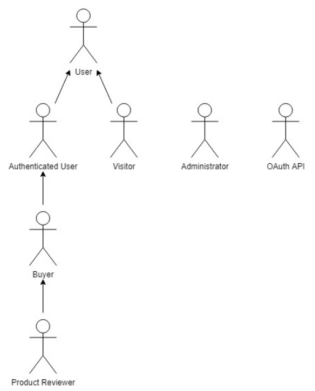
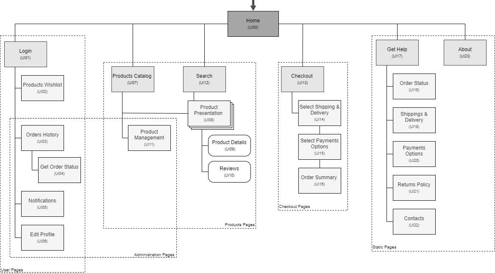

# ER: Requirements Specification Component
SportsVerse! The only place you need for a healthy and active lifestyle
---
## A1: SportsVerse

The SportsVerse project is under development by a small team (stakeholders*), part of a web development company, targeting people that want to consult and order sports clothing, equipment, and supplementation from anywhere they want.  
The main goal of this project is the elaboration of a web-based application that acts as a system to manage an online store. This is a tool whose goal is to ease online shopping, saving customers precious time. 
SportsVerse allows users to navigate through the whole list of products and their reviews, being able to search them by name, category, sort by price and also add them to the cart. Users are divided into groups with different permissions: guests, authenticated users, buyers, and product reviewers. Guests, which are not logged in, will be promoted to authenticated users after doing so, enabling them to checkout their orders, wishlist products, manage their preferences and also view their purchase history.  
After buying a product, Authenticated Users will be considered buyers, having the power to manage and cancel their purchase and the respective delivery, as well as to review it (if so, they will be considered product reviewers). These last two are product-specific roles. On the other hand, to assure a good experience for the users, a team of administrators will have higher permissions to manage all users' purchases, as well as the respective deliveries, being able to change their state and other crucial data, in addition to the control of the exposed products. 
Finally, the platform will have an adaptive design, enhancing the user experience, regardless of the device being used. In that way, everybody can enjoy the benefits of this website.   
*developers, brand, users, and administrators are all considered stakeholders

---

## A2: Actors and User stories

 This artifact contains the specification of the actors and their user stories, serving as agile documentation of the project’s requirements.

### 1. Actors
   
 Figure 1: SportVerse actors.

| Identifier | Description |
|---|---|
|User |Generic user that has access to public information, such as the list of products and their reviews |
|Visitor|Unauthenticated user that can register itself (sign-up) or sign in to the system |
|Authenticated User|Authenticated user that can manage his own preferences, check out his purchases and write reviews|
|Buyer|Authenticated user that can review bought products as well as track and cancel his orders |
|Product Reviewer|Authenticated user that can edit and remove his own review |
|Administrator|Specific account that is responsible for the management of products and for some specific supervisory and moderation functions |
|OAuth API | External OAuth API that can be used to register or authenticate into the system |

Table 1: SportVerse actors description.

### 2. User Stories
 User stories for the SportsVerse system.

#### 2.1. User

 | Identifier | Name | Priority | Description |
 | --- | --- |--- | ---|
 | US101 | View Products List | high | As a User, I want to be able to see the products list, so that I can view what the shop has to offer |
 | US102 | View Product Details | high | As a User, I want to view the product details, so that I can know more about it |
 | US103 | Add Product to Shopping Cart | high | As a User, I want to add products to my shopping cart, so that I can list the products I want to buy |
 | US104 | Manage Shopping Cart | high | As a User, I want to manage my shopping cart, so that I can change the list of products I want to buy|
 | US105 | Search Products | high | As a User, I want to search the platform keywords, so that I can quickly find the items that I am looking for |
 | US106 | See Home | high | As a User, I want to access the home page, so that I can see a brief presentation of the website |
 | US107 | Browse Product Categories | high | As a User, I want to browse through product categories, so that I can view a specific selection of products |
 | US108 | See About | high | As a User, I want to access the about page, so that I can see a complete description of the website and its creators  |
 | US109 | Consult Services | high | As a User, I want to be able to access the services information, so that I can see the website's services |
 | US110 | Consult FAQ | high | As a User, I want to access the FAQ, so that I can get quick answers to common questions |
 | US111 | Consult Contacts | high | As a User, I want to access contacts, so that I can come in touch with the platform creators |
 | US112 | View Product Reviews | high | As a User, I want to view product reviews, so that I can know what other users think about those products |
 | US113 | Sort Products | medium | As a User, I want to be able to sort products, so that I can quickly view the products I’m interested in |
 
 Table 2: User user stories.

#### 2.2. Visitor

| Identifier | Name | Priority | Description |
|-|-|-|-|
|US201|sign in|high|As a Visitor, I want to authenticate into the system, so that I can access privileged information
|US202|Sign-up|high|As a Visitor, I want to register myself into the system, so that I can authenticate myself into the system
|US203|OAuth API Sign in|low|As a Visitor, I want to sign in through my Google account, so that I can authenticate myself into the system
|US204|OAuth API Sign-up|low|As a Visitor, I want to register a new account linked to my Google account, so that I do not need to create a whole new account to use the platform 

Table 3: Visitor user stories.

#### 2.3. Authenticated User

| Identifier | Name | Priority | Description |
|-|-|-|-|
 |US301|Manage Account Information|high|As an Authenticated User, I want to be able to manage my account information, so that I can change it at any time
 |US302|Checkout|high|As an Authenticated User, I want to be able to checkout my order, so that I can buy it
 |US303|Log out|high|As an Authenticated User, I want to be able to log out from my account, so that I can protect my account
 |US304|View Purchase History|high|As an Authenticated User, I want to be able to view my purchase history, so that I can see what I have bought
 |US305|Manage Wishlist|medium|As an Authenticated User, I want to be able to manage my wishlist, so that I may untrack any product I don’t wish to receive a notification about
 |US306|Add Product to Wishlist|medium|As an Authenticated User, I want to add a product to my wishlist, so that I may track its availability
 |US307|Add Payment Method|medium|As an Authenticated User, I want to be able to add a payment method, so that I can pay my order
 |US308|Product in Wishlist Availability Notification|medium|As an Authenticated User, I want to be notified if a product in my wishlist is available, so that I may be able to buy that product
 |US309|Product on Cart Price Change Notification|medium|As an Authenticated User, I want to be notified if a product on my cart changed prices, so that I may be able to make a decision upon it
 |US310|Manage Multiple Payment Methods|low|As an Authenticated User, I want to be able to manage multiple payment methods, so that I can choose different methods at checkout
 |US311|Have Product Recommendations|low|As an Authenticated User, I want to receive product recommendations, so that I may be prompt with recommended products I may want to buy
 |US312|Manage Account Credits|low|As an Authenticated User, I want to be able to manage account credits, so that I may be able to buy products with it
 
 Table 4: Authenticated User user stories.

#### 2.4. Buyer

| Identifier | Name | Priority | Description |
|-|-|-|-|
 |US401|Review Purchased Product|medium|As a Buyer, I want to be able to give a review to a product that I have bought, so that I can share my opinion of it to the platform
 |US402|Track Order|medium|As a Buyer, I want to be able to track an order, so that I may know its status at any time
 |US403|Cancel Order|medium|As a Buyer, I want to be able to cancel an order, so that I may have my money refunded and return the products
 |US404|Payment Approved Notification|medium|As a Buyer, I want to be notified if my payment was approved, so that I know if the order may be proceeded
 |US405|Order Processing Stage Change Notification|medium|As a Buyer, I want to be notified if my order processing changed state, so that I know if my order is coming
 
 Table 5: Buyer user stories.

#### 2.5. Product Reviewer

| Identifier | Name | Priority | Description |
|-|-|-|-|
|US501|Edit Review|medium|As a Product Reviewer, I want to be able to edit my review, so that I can share my new opinion on the product
|US502|Remove Review|medium|As a Product Reviewer, I want to be able to remove my review, so that it disappears from the platform

Table 6: Product Reviewer user stories.

#### 2.6. Administrator

 | Identifier | Name | Priority | Description |
 |-|-|-|-| 
 | US601 | Manage Order Status | medium | As an Admin, I want to be able to manage the order status, so that the User may know the status up-to-date 
 | US602 | Add Product | medium | As an Admin, I want to be able to add products to the platform, so that Users may be able to buy them 
 | US603 | Manage Products Information | medium | As an Admin, I want to be able to change a product’s information, so that it is up-to-date 
 | US604 | Manage Product Stock | medium | As an Admin, I want to be able to manage a product’s stock, so that its availability is up-to-date 
 | US605 | Manage Products Categories | medium | As an Admin, I want to be able to manage a product’s category, so that it may be up-to-date 
 | US606 | View User’s Purchase History | medium | As an Admin, I want to be able to view a user’s purchase history, so that I can recomend him the adequate products 
 | US607 | Remove reviews | medium | As an Admin, I want to remove a review, so that I can remove inappropriate content 
 | US608 | View Sales Statistics | low | As an Admin, I want to be able to view sales statistics, so that I may be able to see how frequent a product is bought 
 | US609 | Manage Product Discounts | low | As an Admin, I want to be able to manage product discounts, so that I may be able to give the platform discount offers 
 | US610 | Manage Reports | low | As an Admin, I want to be able to manage reports, so that I can take the adequate decision upon them 
 
 Table 7: Admin user stories.

### 3. Supplementary Requirements

#### 3.1. Business rules
 
 | Identifier | Name | Description
 | - | - | - | 
 | BR01 | Administrators Aren’t Users | Administrators accounts are independent of the user accounts, i.e. they cannot buy products. 
 | BR02 | Give a review | Reviews can only be made after a product has been received by the buyer.
 | BR03 | Answer Reviews | Reviews relate to products only and therefore can’t be answered by other users. 
 | BR04 | User Deletion | When an authenticated user account gets deleted, all the reviews made are still available on the website as an anonymous user, as well as the purchase history 
 | BR05 | Product Orderering | A product can only be ordered, by an authenticated user, if there is at least a single unit in stock and at most, the same amount available.
 | BR06 | Product Info | On the product page, there must be a name, price, number of items to order, a short and a detailed description and the review list.
 | BR06 | Dates | The dates of any action must be in agreement with any prior and/or post action taken, e.g. the log-out date must come after the log-in date.

 Table 8: SportsVerse business rules.

#### 3.2. Technical requirements

 | Identifier | Name | Description
 | - | - | - | 
 | TR01 | Availability | The system must be available 99 percent of the time in each 24-hour period. 
 | TR02 | Accessibility | The system must ensure that everyone can access the pages, regardless of whether they have any handicap or not, or the web browser they use. 
 | **TR03** | **Usability** | **The system should be simple and easy to use. The SportsVerse system is designed to be used by media consumers of all ages, with or without technical experience, so very good usability is a critical requirement.** 
 | TR04 | Performance | The system should have response times shorter than 2 s to ensure the user's attention. 
 | TR05 | Web application | The system should be implemented as a web application with dynamic pages (HTML5, JavaScript, CSS3 and PHP). It is critical that the SportsVerse system is easily accessible from anywhere without the need to install specific applications or software, adopting standard web technologies. 
 | TR06 | Portability | The server-side system should work across multiple platforms (Linux, Mac OS, etc.). The SportsVerse system is destined for personal use. To make it easily available to a large user base, it should be platform-independent. 
 | TR07 | Database | The PostgreSQL database management system must be used, with a version of 11 or higher. 
 | **TR08** | **Security** | **The system shall protect information from unauthorized access through the use of an authentication and verification system. This is crucial due to the critical information disclosed by the users.**
 | TR09 | Robustness | The system must be prepared to handle and continue operating when runtime errors occur. 
 | TR10 | Scalability | The system must be prepared to deal with the growth in the number of users and their actions. 
 | **TR11** | **Ethics** | **The system must respect the ethical principles in software development (for example, personal user details, or usage data, should not be collected nor shared without full acknowledgment and authorization from its owner) as a lot of the information disclosed is classified.** 
 
 Table 9: SportsVerse technical requirements.

#### 3.3. Restrictions

 | Identifier | Name | Description|
 | - | - | - |
 | C01 | Deadline | The system should be ready to be used before the project deadline.
 
 Table 10: SportVerse project restrictions.

---

## A3: Information Architecture

#### This artifact presents a brief overview of the information architecture of the system to be developed. It has the following goals:

 * Help to identify and describe the user requirements, and raise new ones;
 * Preview and empirically test the user interface of the product to be developed;
 * Enable quick and multiple iterations on the design of the user interface.

### 1. Sitemap

 SportsVerse system is organized in five main areas:

* User Pages &rarr; Individual user page and others related to personal services to the users;
* Administration Pages &rarr; Exclusive for the Administrators, to keep users always updated about orders and products;
* Products Pages &rarr; Used to access the items collection and its specifications;
* Checkout Pages &rarr; Deals with the processing of an order;
* Static Pages &rarr; Provide general information about the system;

   
 Figure 1: SportsVerse sitemap.

### 2. Wireframes

 For the SportsVerse system, the wireframes for the Home Page (UI00) and the Product Presentation Page (UI02) are presented in Figures 2 and 3, respectively.

#### UI00: Home Page

   
 Figure 2: Home Page (UI00) wireframe.

#### UI02: Product Presentation

   
 Figure 3: Product Presentation Page (UI02) wireframe.

---

## Revision history

Changes made to the first submission:
1. Changed user stories priorities

---

GROUP2223, 02/10/2022

* Bárbara Ema Pinto Rodrigues, up202007163@fe.up.pt
* Henrique Oliveira Silva, up202007242@fe.up.pt
* João Paulo Moreira Araújo, up202004293@fe.up.pt
* Tiago Nunes Moreira Branquinho, up202005567@fe.up.pt
