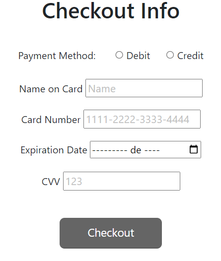
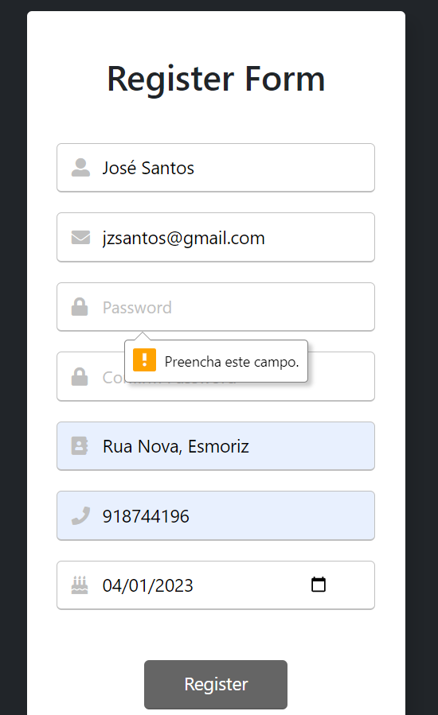
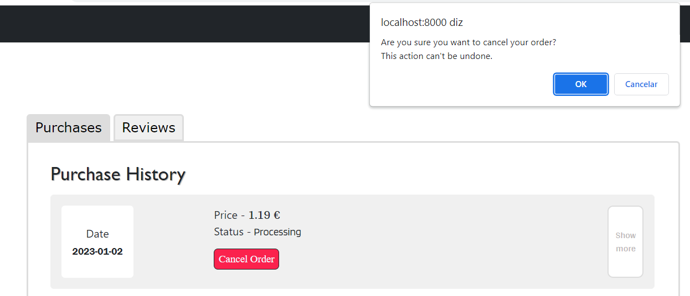
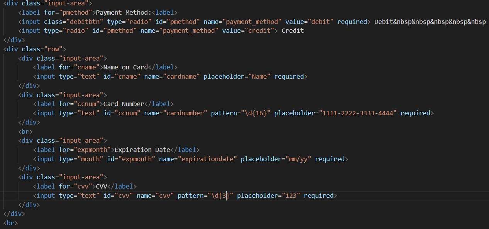
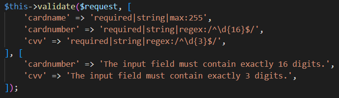
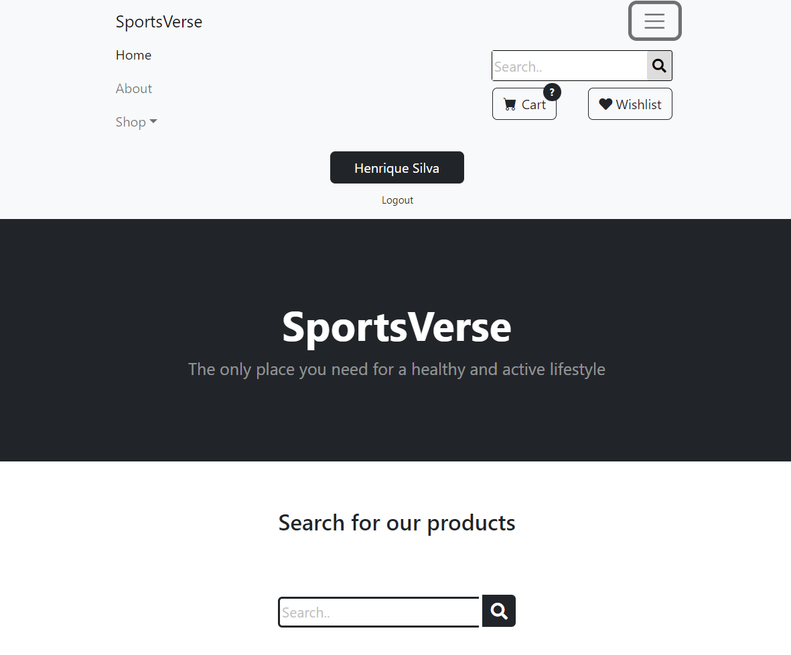
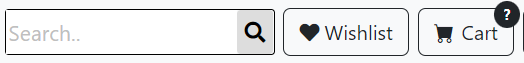
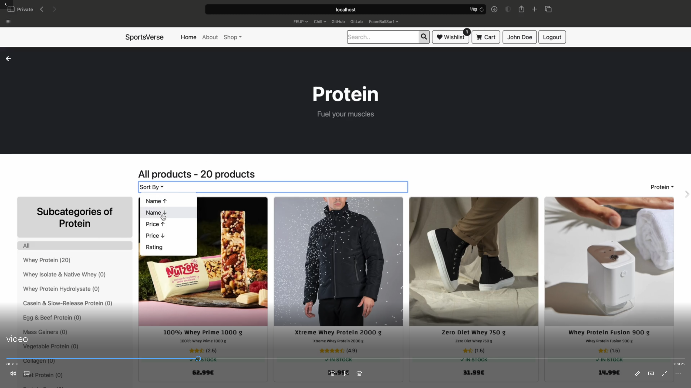

# PA: Product and Presentation

SportsVerse! The only place you need for a healthy and active lifestyle

---

## A9: Product

The product developed consists in a online shop for a sports store, specialized in selling supplements.
Our online shop is built on the Laravel framework and utilizes a PostegreSQL database to store and retrieve product and customer data.
Through our website users will be able to search, buy and review the available products, as well as track their purchases dynamic status.

### 1. Instalation

- Link to the final product repository:[Final Version](https://git.fe.up.pt/lbaw/lbaw2223/lbaw2223/-/tags/Final_Product).
- Docker command to start the image: docker run -it -p 8000:80 --name=lbaw2223 -e DB_DATABASE="lbaw2223" -e DB_SCHEMA="sportsverse" -e DB_USERNAME="lbaw2223" -e DB_PASSWORD="DgHylkDp" git.fe.up.pt:5050/lbaw/lbaw2223/lbaw2223

---

### 2. Usage

- Url to the product: http://lbaw2223.lbaw.fe.up.pt

#### 2.1. Administration Credentials

<table>
    <tr>
        <td>Email</td>
        <td>Password</td>
    </tr>
    <tr>
        <td>admin@gmail.com</td>
        <td>1234</td>
    </tr>
</table>

#### 2.2. User Credentials

<table>
    <tr>
        <td>Email</td>
        <td>Password</td>
    </tr>
    <tr>
        <td>heathburns@gmail.com</td>
        <td>1234</td>
    </tr>
</table>

---

### 3. Application Help

Help as been implemented in three distinct ways:

- Using placeholders in forms:
  

- Using error messages:
  

- Using contextual help (per exaple using popups):
  

---

### 4. Input Validation

Input validation was done both in client-side and server-side, per example in checkout:
  

- Client-Side Validation
  

- Server-Side Validation
  

---

### 5. Check Accessibility and Usability

- Accessibility: [Link to the Accessibility pdf](https://git.fe.up.pt/lbaw/lbaw2223/lbaw2223/-/blob/b0d1ab19733bf1dec72f7652fb5739cd16e466c4/Components/PA/docs/Usability.pdf).
- Usability: [Link to the Usability pdf](https://git.fe.up.pt/lbaw/lbaw2223/lbaw2223/-/blob/b0d1ab19733bf1dec72f7652fb5739cd16e466c4/Components/PA/docs/Accessibility.pdf).

---

### 6. HTML & CSS Validation

- HTML:
    - Homepage: [Link to the homepage HTML Validation pdf](https://git.fe.up.pt/lbaw/lbaw2223/lbaw2223/-/blob/6b05e8396876a2f17c4baf288008303e6640daf1/Components/PA/docs/homepage_html.pdf).
    - Profile: [Link to the profile HTML Validation pdf](https://git.fe.up.pt/lbaw/lbaw2223/lbaw2223/-/blob/6b05e8396876a2f17c4baf288008303e6640daf1/Components/PA/docs/profile_html.pdf).
    - Product: [Link to the product HTML Validation pdf](https://git.fe.up.pt/lbaw/lbaw2223/lbaw2223/-/blob/6b05e8396876a2f17c4baf288008303e6640daf1/Components/PA/docs/product_html.pdf).
- CSS: 
    - Homepage: [Link to the homepage CSS Validation pdf](https://git.fe.up.pt/lbaw/lbaw2223/lbaw2223/-/blob/6b05e8396876a2f17c4baf288008303e6640daf1/Components/PA/docs/homepage_css.pdf).
    - Profile: [Link to the profile CSS Validation pdf](https://git.fe.up.pt/lbaw/lbaw2223/lbaw2223/-/blob/6b05e8396876a2f17c4baf288008303e6640daf1/Components/PA/docs/profile_css.pdf).
    - Product: [Link to the product CSS Validation pdf](https://git.fe.up.pt/lbaw/lbaw2223/lbaw2223/-/blob/6b05e8396876a2f17c4baf288008303e6640daf1/Components/PA/docs/product_css.pdf).

Note that, the majority of the errors and warnings is due to external libraries and not the code developed by us.

---

### 7. Revisions to the Project

- None

---

### 8. Web Resources Specification

[Link to the a9_openapi.yaml](https://git.fe.up.pt/lbaw/lbaw2223/lbaw2223/-/blob/2db5b0513636bbcba19edd10eb0cd9ddd1fb7e9c/Components/PA/docs/openapi/a9_openapi.yaml).

---

### 9. Implementation Details

#### 9.1. Libraries Used

- Laravel: server framework

- Bootstrap (https://cdn.jsdelivr.net/npm/bootstrap@5.1.3/dist/js/bootstrap.bundle.min.js): CSS framework, enables responsive design

-   

- Font Awesome (https://kit.fontawesome.com/a076d05399.js): icon library and toolkit for icons

- Bootstrap Icons (https://cdn.jsdelivr.net/npm/bootstrap-icons@1.5.0/font/bootstrap-icons.css): open source icon library for icons

-   

- Google Fonts
    - (https://fonts.googleapis.com/css?family=Blinker)
    - (https://fonts.googleapis.com/css?family=Arya)
    - (https://fonts.googleapis.com/css?family=Changa)
    - (https://fonts.googleapis.com/css?family=Bungee)

#### 9.2. User Stories

 | Identifier | Name | Priority | Description | Team Members | State|
 | --- | --- | --- | --- | --- | --- |
 | US101 | View Products List | high | As a User, I want to be able to see the products list, so that I can view what the shop has to offer | **Tiago Branquinho** | 100% |
 | US102 | View Product Details | high | As a User, I want to view the product details, so that I can know more about it | **João Araújo**  | 100% |
 | US103 | Add Product to Shopping Cart | high | As a User, I want to add products to my shopping cart, so that I can list the products I want to buy | **Henrique Silva** | 100% |
 | US104 | Manage Shopping Cart | high | As a User, I want to manage my shopping cart, so that I can change the list of products I want to buy| **Henrique Silva** | 100% |
 | US105 | Search Products | high | As a User, I want to search the platform keywords, so that I can quickly find the items that I am looking for | **Henrique Silva** | 100% |
 | US106 | See Home | high | As a User, I want to access the home page, so that I can see a brief presentation of the website | **Bárbara Rorigues**, **Henrique Silva** | 100% |
 | US107 | Browse Product Categories | high | As a User, I want to browse through product categories, so that I can view a specific selection of products | **Tiago Branquinho** | 100% |
 | US108 | See About | high | As a User, I want to access the about page, so that I can see a complete description of the website and its creators  |**Bárbara Rorigues**, **João Araújo**| 100% |
 | US109 | Consult Services | high | As a User, I want to be able to access the services information, so that I can see the website's services |**Bárbara Rorigues**, **João Araújo**| 100% |
 | US110 | Consult FAQ | high | As a User, I want to access the FAQ, so that I can get quick answers to common questions |**Bárbara Rorigues**, **João Araújo**| 100% |
 | US111 | Consult Contacts | high | As a User, I want to access contacts, so that I can come in touch with the platform creators |**Bárbara Rorigues**, **João Araújo**| 100% |
 | US112 | View Product Reviews | high | As a User, I want to view product reviews, so that I can know what other users think about those products |  **João Araújo** | 100% |
 | US113 | Sort Products | medium | As a User, I want to be able to sort products, so that I can quickly view the products I’m interested in | **Tiago Branquinho**, Bárbara Rodrigues | 100% |
 | US201 | sign in | high | As a Visitor, I want to authenticate into the system, so that I can access privileged information | **Tiago Branquinho** | 100% |
 | US202 | Sign-up | high | As a Visitor, I want to register myself into the system, so that I can authenticate myself into the system | **Tiago Branquinho** | 100% |
 | US203 | OAuth API Sign in|low|As a Visitor, I want to sign in through my Google account, so that I can authenticate myself into the system | - | 0% |
 | US204 | OAuth API Sign-up|low|As a Visitor, I want to register a new account linked to my Google account, so that I do not need to create a whole new account to use the platform | - | 0% |
 | US301 | Manage Account Information | high | As an Authenticated User, I want to be able to manage my account information, so that I can change it at any time | **João Araújo** | 100% |
 | US302 | Checkout | high | As an Authenticated User, I want to be able to checkout my order, so that I can buy it | **Henrique Silva** | 100% |
 | US303 | Log out | high | As an Authenticated User, I want to be able to log out from my account, so that I can protect my account | **Tiago Branquinho** | 100% |
 | US304 | View Purchase History | high | As an Authenticated User, I want to be able to view my purchase history, so that I can see what I have bought | **Tiago Branquinho**, Henrique Silva | 100% |
 | US305 | Manage Wishlist | medium | As an Authenticated User, I want to be able to manage my wishlist, so that I may untrack any product I don’t wish to receive a notification about | **Henrique Silva** | 100% |
 |US306|Add Product to Wishlist|medium|As an Authenticated User, I want to add a product to my wishlist, so that I may track its availability|**Henrique Silva**|100%|
 |US307|Add Payment Method|medium|As an Authenticated User, I want to be able to add a payment method, so that I can pay my order|**João Araújo**, **Henrique Silva**, **Tiago Branquinho**|100%|
 |US308|Product in Wishlist Availability Notification|medium|As an Authenticated User, I want to be notified if a product in my wishlist is available, so that I may be able to buy that product|**João Araújo**|100%|
 |US309|Product on Cart Price Change Notification|medium|As an Authenticated User, I want to be notified if a product on my cart changed prices, so that I may be able to make a decision upon it|**João Araújo**|100%|
 |US401|Review Purchased Product|high|As a Buyer, I want to be able to give a review to a product that I have bought, so that I can share my opinion of it to the platform|**João Araújo**|100%|
 |US402|Track Order|medium|As a Buyer, I want to be able to track an order, so that I may know its status at any time|**Henrique Silva**|100%|
 |US403|Cancel Order|medium|As a Buyer, I want to be able to cancel an order, so that I may have my money refunded and return the products|**Henrique Silva**|100%|
 |US404|Payment Approved Notification|medium|As a Buyer, I want to be notified if my payment was approved, so that I know if the order may be proceeded|-|0%|
 |US405|Order Processing Stage Change Notification|medium|As a Buyer, I want to be notified if my order processing changed state, so that I know if my order is coming|-|0%|
 |US501|Edit Review|high|As a Product Reviewer, I want to be able to edit my review, so that I can share my new opinion on the product|**João Araújo**|100%|
 |US502|Remove Review|high|As a Product Reviewer, I want to be able to remove my review, so that it disappears from the platform|**João Araújo**|100%|
 | US601 | Manage Order Status | medium | As an Admin, I want to be able to manage the order status, so that the User may know the status up-to-date|**Henrique Silva**,**Bárbara Rodrigues**|100%|
 | US602 | Add Product | medium | As an Admin, I want to be able to add products to the platform, so that Users may be able to buy them|**Henrique Silva**|100%| 
 | US603 | Manage Products Information | medium | As an Admin, I want to be able to change a product’s information, so that it is up-to-date|**Henrique Silva**|100%| 
 | US604 | Manage Product Stock | medium | As an Admin, I want to be able to manage a product’s stock, so that its availability is up-to-date|**Henrique Silva**|100%| 
 | US605 | Manage Products Categories | medium | As an Admin, I want to be able to manage a product’s category, so that it may be up-to-date|**Henrique Silva**|100%| 
 | US606 | View User’s Purchase History | medium | As an Admin, I want to be able to view a user’s purchase history, so that I can recomend him the adequate products|**Tiago Branquinho**, Henrique Silva|100%| 
 | US607 | Remove reviews | medium | As an Admin, I want to remove a review, so that I can remove inappropriate content|**João Araújo**|100%| 

## 10: Presentation

This artifact corresponds to the presentation of the product.

---

### 1. Product presentation

- The product developed consists in a online shop for a sports store, specialized in selling supplements. Through our website users will be able to search, buy and review the available products, as well as track their purchases dynamic status. Administrators will have the capacity to add and edit new products and categories, block and ban users, and manage their reviews and purchases.

- URL to the product: http://lbaw2223.lbaw.fe.up.pt

- Slides used during the presentation: [Link to the presentation.pdf]().

---

### 2. Video presentation

- Screenshoot of the video: .

- Link to the video: [Link to the lbaw2223.mp4](https://git.fe.up.pt/lbaw/lbaw2223/lbaw2223/-/blob/c04ea6f226cf077897239cdaac2412eeffe67667/Components/PA/docs/lbaw2223.mp4).

---

## Revision history

Changes made to the first submission:

---

GROUP2223, 21/10/2022

* Bárbara Ema Pinto Rodrigues, up202007163@fe.up.pt
* Henrique Oliveira Silva, up202007242@fe.up.pt
* João Paulo Moreira Araújo, up202004293@fe.up.pt
* Tiago Nunes Moreira Branquinho, up202005567@fe.up.pt
